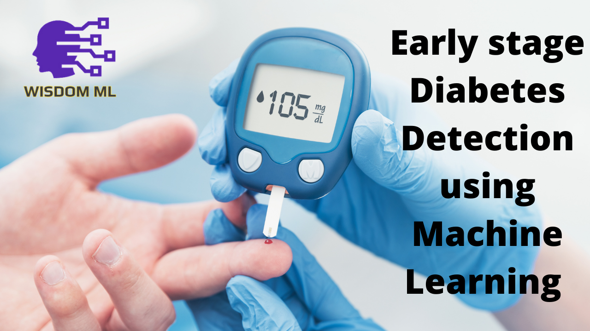
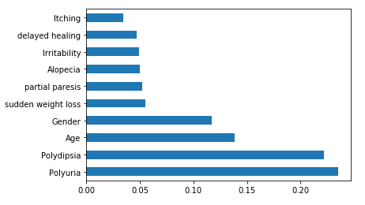
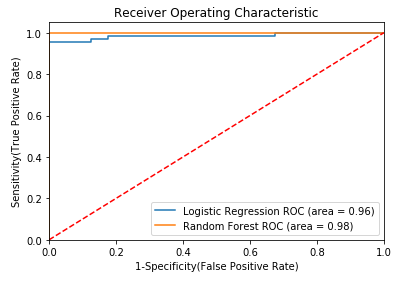

# Early stage diabetes prediction using Machine Learning
[](https://www.youtube.com/watch?v=tK8PGomidp8&t=2s)


## Project Overview :
In this project I have predicted the chances of diabetes using Early stage diabetes risk prediction dataset.This has been collected using direct questionnaires from the patients of Sylhet Diabetes Hospital in Sylhet, Bangladesh and approved by a doctor. This dataset contains the sign and symptpom data of newly diabetic or would be diabetic patient.

The datasets consists of several medical predictor variables and one target variable, **class**. Predictor variables includes the Age, gender, Polyuria,Polydipsia  and so on.
The dataset used is available at [UCI Machine Learning repository](https://archive.ics.uci.edu/ml/datasets/Early+stage+diabetes+risk+prediction+dataset.)


## Installations :
This project requires Python 3.x and the following Python libraries should be installed to get the project started:
- [Numpy](http://www.numpy.org/)
- [Pandas](http://pandas.pydata.org/)
- [matplotlib](https://matplotlib.org/)
- [scikit-learn](https://scikit-learn.org/stable/)
- [seaborn](https://seaborn.pydata.org/installing.html)

I also reccommend to install Anaconda, a pre-packaged Python distribution that contains all of the necessary libraries and software for this project which also include jupyter notebook to run and execute [IPython Notebook](http://ipython.org/notebook.html).

## Code :
Actual code to get started with the project is provided in two files one is,```Early Stage Diabetes Prediction.ipynb```

## Run :
In a terminal or command window, navigate to the top-level project directory PIMA_Indian_Diabetes/ (that contains this README) and run one of the following commands:

```ipython notebook Early Stage Diabetes Prediction.ipynb```
or

```jupyter notebook Early Stage Diabetes Prediction.ipynb```

This will open the Jupyter Notebook software and project file in your browser.

### About Data
This dataset contains the sign and symptpom data of newly diabetic or would be diabetic patient.This has been collected using direct questionnaires from the patients of Sylhet Diabetes Hospital in Sylhet, Bangladesh and approved by a doctor.

#### Features of the dataset
The dataset consist of total **16** features and one target variable named class.

**1. Age:** Age in years ranging from (20years to 65 years)<br>
**2. Gender:** Male / Female<br>
**3. Polyuria:** Yes / No<br>
**4. Polydipsia:** Yes/ No<br>
**5. Sudden weight loss:** Yes/ No <br>
**6. Weakness:** Yes/ No<br>
**7. Polyphagia:** Yes/ No<br>
**8. Genital Thrush:** Yes/ No<br>
**9. Visual blurring:** Yes/ No<br>
**10. Itching:** Yes/ No<br>
**11. Irritability:** Yes/No<br>
**12. Delayed healing:** Yes/ No<br>
**13. Partial Paresis:** Yes/ No<br>
**14. Muscle stiffness:** yes/ No<br>
**15. Alopecia:** Yes/ No<br>
**16. Obesity:** Yes/ No<br>

**Class:** Positive / Negative

## Steps to be Followed :
Following steps I have taken to apply machine learning models:

- Importing Essential Libraries.
- Data Preparation & Data Cleaning.
- Data Visualization (already done in early_Diabetes_Prediction_EDA.ipynb)
- Feature Engineering to discover essential features in the process of applying machine learning.
- Encoding Categorical Variables.
- Train Test Split
- Apply Machine Learning Algorithm
- Cross Validation
- Model Evaluation

## Model Evaluation :
I have done model evaluation based on following sklearn metric.
- [Cross Validation Score] (https://scikit-learn.org/stable/modules/generated/sklearn.model_selection.cross_val_score.html)
- [Confusion Matrix] (https://scikit-learn.org/stable/modules/generated/sklearn.metrics.confusion_matrix.html)
- [Plotting ROC-AUC Curve] (https://en.wikipedia.org/wiki/Receiver_operating_characteristic)
- [Sensitivity and Specitivity] (https://en.wikipedia.org/wiki/Sensitivity_and_specificity)
- [Classification Error] (https://www.dataschool.io/simple-guide-to-confusion-matrix-terminology/)

## Results :
The result of Logistic Regression and Random forest algorithms with or without feature selection is shown below.


## Feature Importance :


## ROC Curve :



